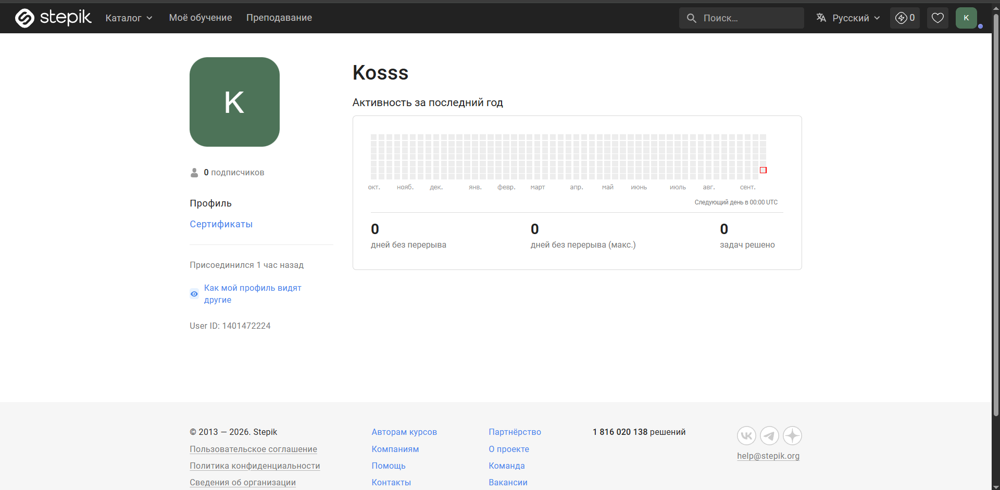
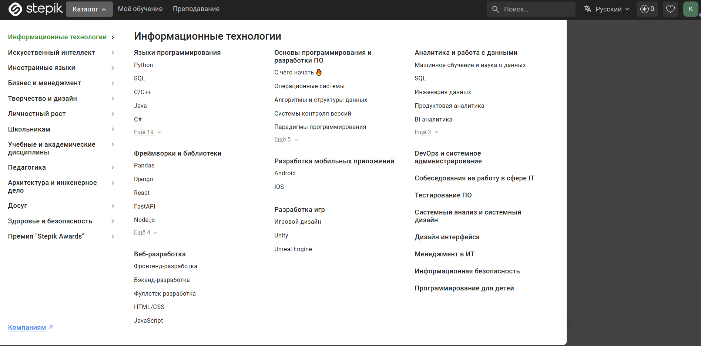
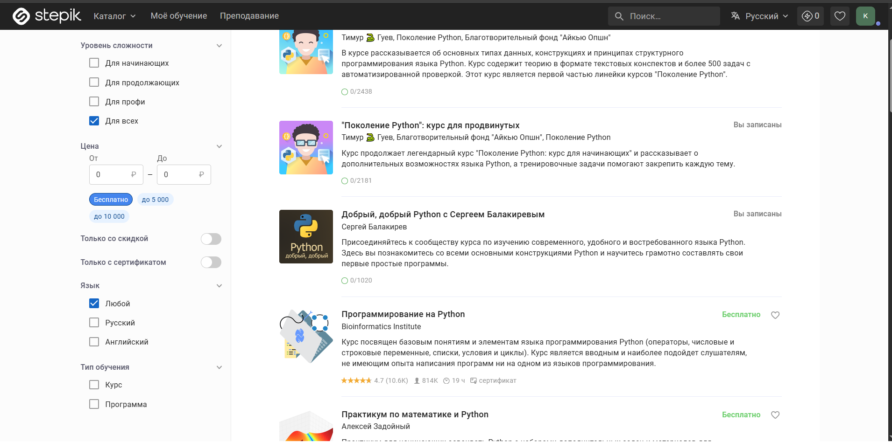
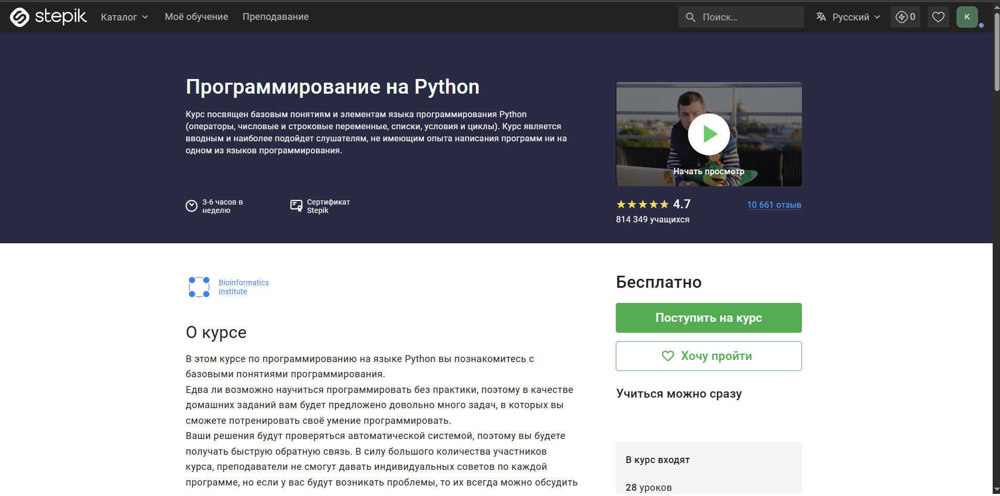
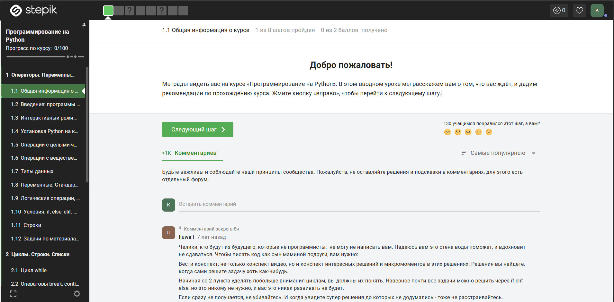
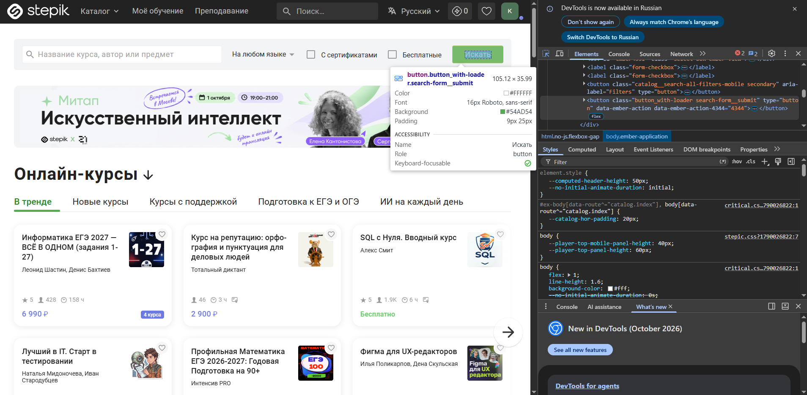
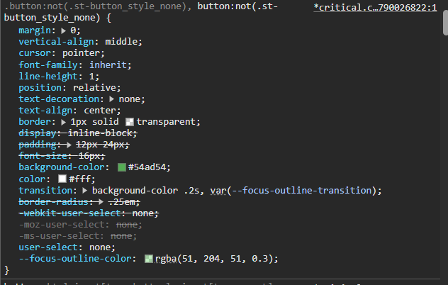
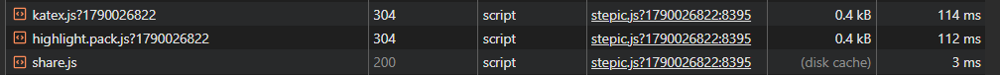

# computer-science-lab1

## Лабораторная работа №1

Название:Stepic

Ссылка:https://stepik.org/

Назначение:
Stepik — образовательная платформа со множествами курсами для прохождения, бесплатными и платными, с возможностью получения сертификата.

Целевая аудитория:
- Студенты.
- Учащиеся школы.
- Люди, готовящиеся сдать ЕГЭ или ОГЭ.
- Люди, повышающие свою классификацию.
- Разработчики игр.
- Веб-разработчики.

Основные возможности:
- Выбор курса.
- Фильтрация поиска.
- Настройка языка сайта.
- Публикация курса.
- Обратная связь с учащимися на курсе.
- Обращение в поддержку.

Выбранный сценарий:
Поиск курса и открытие урока.

В рамках сценария пользователь региструется на сайте, открывает каталог, ищет, подходящий курс, или ищет нужный курс с помощью строки поиска, нажимает кнопку поступить на курс и далее продолжить, начинает прохождение курса.

## 2. Анализ пользовательского интерфейса

### 2.1 Основные страницы и разделы

В рамках лабораторной работы исследуется образовательная информационная система Stepik.

В системе используются следующие основные страницы и разделы:

- Главная страницы.
- Страница авторизации.
- Личный кабинет пользователя.
- Страница настроек.
- Страница уведомлений.
- Страница с курсами, выпранными пользователем.
- Каталог курсов
- Страница созданных курсов
- Разные страницы с инструкциями, например, создания курса.

Некторые страницы доступны только после регистрации, например, прохождение курса.

### 2.2. Ключевые элементы интерфейса

| Элемент интерфейса             | Назначение                                        |
|--------------------------------|---------------------------------------------------|
| Логотип Stepik                 | Переход на главную страницу или в личный кабинет  |
| Главное меню                   | Навигация между основными разделами системы       |
| Личный кабинет                 | Управление курсами и страницами пользователя      |
| Кнопка каталог                 | Навигация между курсами                           |
| Кнопка преподование            | Создание курса                                    |
| Кнопка моё обучение            | Навигация между выбранными курсами                |
| Кнопка войти                   | Регистрация или создание профиля                  |
| Кнопака выбора языка           | Выбор языка                                       |
| Поисковая строка               | Поиск нужного кусра                               |
| Кнопка купить                  | Купить курс                                       |
| Кнопка пройти курс             | Переадресация на страницу курса                   |

### 2.3. Выполнение пользовательского сценария

Выбранный сценарий: поиск курса и открытие урока.

Последовательность действий:

1. Открыть сайт Stepik.
2. Выполнить авторизацию в личном кабинете.
3. Открыть каталог и выбрать нужную категорию.
4. Настроить поиск
5. Выбрать курс
6. Оплатить курс, если он платынй
7. Нажать кнопку поступить на курс
8. Нажать кнопку продолжить
9. Начать прохождение курса

В результате выполнения сценария пользователь начал прохождение курса.

### 2.4. Компоненты, участвующие в сценарии

| Компонент интерфейса      | Назначение                                        | Этап сценария |
|---------------------------|---------------------------------------------------|---------------|
| Форма авторизации         | Позволяет пользователю войти в личный кабинет     | 2             |
| Кнопка католог            | Поиск курсов                                      | 3             |
| Список настроек           | Настройка поиска курса                            | 4             |
| Кнопка кусрса             | Переход на страничку курса                        | 5             |
| Кнопка оплаты             | Оплачивает курс                                   | 6             |
| Кнопка поступить на курс  | Записывет пользователя на курс                    | 7             |
| Кнопка продолжить         | Переход на страничку курса                        | 8             |

#### Скриншот 1. Личный кабинет Stepik

#### Скриншот 2. Каталог

#### Скриншот 3. Выбор курса

#### Скриншот 4. Запись на курс

#### Скриншот 5. Прохождение курса

### 2.6. Вывод

В ходе анализа пользовательского интерфейса Stepik были определены основные страницы системы и ключевые элементы
управления.

Выбранный сценарий состоит из следующих основных этапов:

- переход в личный кабинет;
- регистрация;
- выбор курса;
- открытие курса;
- регистрация на курс;
- начало прохождение или оплата курса, а затем прохождение;

## 3. Анализ клиентской части

### 3.1. Исследование HTML-структуры

Для анализа была выбрана кнопка "Искать".

Элемент используется для вывода курсов подходящих под назначенные фильры.

Основные характеристики элемента:

- HTML-тег: `<button class="button_with-loader search-form__submit" type="button" data-ember-action="" data-ember-action-4344="4344"> <!----> Искать </button>`
- CSS-классы: `button_with-loader search-form__submit` отвечающих за оформление и поведение
  элемента
- Текст элемента: «Искать»
- Вложенные элементы: текст "Искать"

Скриншот HTML-структуры:

Для выбранного элемента были обнаружены CSS-классы, определяющие его внешний вид и положение на странице.

Основные свойства:

| Свойство           | Назначение                                      |
|--------------------|-------------------------------------------------|
| `display`          | Определяет способ отображения элемента          |
| `padding`          | Задает внутренние отступы                       |
| `font-size`        | Определяет размер текста                        |
| `color`            | Определяет цвет текста                          |
| `background`       | Определяет фон элемента                         |
| `background-color` | Определяет цвет фона                            |
| `transition`       | Плавно изменяет CCS-свойства                    |

Скриншот CSS-стилей:

### 3.3. Исследование JavaScript

### 3.4. Загружаемые ресурсы

Были обнаружены следующие типы ресурсов:

| Тип        | Пример            | Назначение                        |
|------------|-------------------|-----------------------------------|
| Document   | HTML-страница     | Загрузка страницы                 |
| Script     | JavaScript-файлы  | Работа клиентской логики          |
| Stylesheet | CSS-файлы         | Оформление интерфейса             |
| Image      | Изображения       | Отображение графических элементов |
| Fetch/XHR  | Запросы к серверу | Обмен данными                     |

### 3.5. Вывод

В ходе анализа клиентской части Tilda были изучены:

- HTML-структура элемента интерфейса;
- CSS-классы и основные стили;
- JavaScript-файлы и их роль в работе интерфейса;
- загружаемые ресурсы;
- сетевые запросы браузера.

## 4. Анализ серверной части и API

В рамках выбранного сценария «Поиск курса и открытие урока» можно предположить выполнение следующих серверных операций:

- получение данных проекта пользователя при регистрации;
- получение данных о фильтрах при поиске курса;
- сохранение выбранных курсов;
- загрузка и получение необходимых ресурсов;

### 4.2. Передаваемые данные

- идентификатор страницы;
- данные выбранного курса;
- данные пользователя;

### 4.3. API и сетевое взаимодействие

В разделе Network были обнаружены запросы типа `Fetch`.

API позваляет пользователю иметь постоянное соединение с сервером.

### 4.4. Внешние сервисы

Браузер также может обращаться к внешним источникам.

Например:
- загрузка шрифтов
- загрузки изображений
- и т.д.

### 4.5. Хранилища данных

| Хранилище            | Предполагаемое назначение                                     |
|----------------------|---------------------------------------------------------------|
| База данных          | Хранение пользователей, проектов, страниц и настроек          |
| Файловое хранилище   | Хранение изображений и других загруженных файлов              |
| Кэш                  | Быстрый доступ к часто используемым данным                    |
| Браузерное хранилище | Хранение части данных непосредственно на стороне пользователя |

### 4.6. Общая схема взаимодействия

